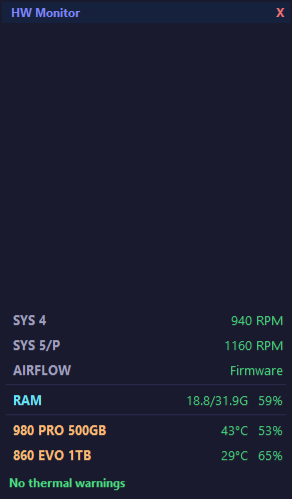
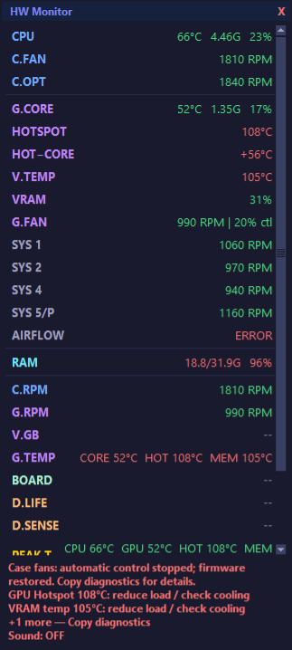

# HeatMap 1.1.0 audit

Scope: sensor selection and validity, thermal warnings, fan lifecycle/status,
configuration persistence, window layout and release packaging. The existing
driver bundle, autostart security contract and fan curves remain the baseline.

Implementation and verification checklist:

- [x] Reproduce GPU fan monitoring gaps and associate fan warnings with their component.
- [x] Report missing previously available temperatures and required airflow inputs.
- [x] Bound controller error text; expose omitted warnings and full diagnostics.
- [x] Exercise actual Tk layout with Details, long names and constrained work areas;
      keep content reachable without losing the header or warning panel.
- [x] Validate persisted fan calibration independently of automatic activation.
- [x] Run focused regressions, full suites, native layout and runtime checks.
- [x] Restart the local overlay and verify controller operation.

Publication evidence belongs to the versioned GitHub release and its matching
Actions runs; source archives are checked again before upload.

Residual acceptance remains in AUDIT.md: real multiple monitors/mixed DPI,
Explorer Show Desktop scenarios and controlled gaming temperature comparison.

## Confirmed findings

| Area | Before | Repair and evidence |
| --- | --- | --- |
| GPU control pairing | Last Control sensor could be displayed as fan duty, including Power Limit. Last Fan sensor hid other tachometers. | Stable fan-channel list and matching fan controls; reversed enumeration, generic/numbered names and unrelated controls tested. |
| Fan alarms | GPU tachometers were absent from stall detection. CPU fan alarms could be driven solely by GPU temperature. | Component-specific heat predicates, prior running evidence, ten-second persistence, multi-GPU-fan red row and sound regression. |
| Missing readings | A missing Hotspot/VRAM temperature could coexist with “No thermal warnings” and full airflow. | Previously detected optional sensors and required automatic-control inputs produce explicit missing-reading warnings. GPU identities keep capabilities separate. |
| Error panel | A filesystem path could generate thousands of characters; warnings after the third were silently hidden. | Bounded summary, restoration status, omitted count, full click-to-copy diagnostics and always-visible mute indication. |
| Layout | Native expanded Tk fixture requested 767 pixels before adding disks; short work areas lost lower content. | Scrollable metric area with fixed header/footer, wrapped disk names, target-monitor fitting and preserved desktop position during Peek. |
| Configuration | Non-finite/invalid fan calibration survived normalization, then made every JSON save fail. | Invalid calibration is removed with a configuration warning; save regression passes. Calibration validation still precedes hardware use. |
| Release archive | Default test discovery failed on a Git-index check when run from the source ZIP. | Explicit skip only without `.git`; local artifact hash coverage remains active. |

Coordinate syntax and large-coordinate startup were also probed with actual Tk;
the suspected crash did not reproduce, so no coordinate-parser rewrite was made.
Sensor recovery, worker restoration/status ownership, launchers and runtime integrity
retain their existing regression coverage. No new native driver changes were required.

## Visual verification

Actual Tk widgets were exercised without sensors, user configuration writes or
visible windows, at scaling factors 1.333, 2.0 and 2.666. Expanded content stayed
inside a simulated 640-pixel work area and scrolled; collapsing Details reset
scroll position. Peek used its simulated target monitor without replacing the saved
desktop position. These are Tk layout checks, not physical mixed-DPI acceptance.

The following images are synthetic UI fixtures, not current hardware readings:

## Runtime verification

- Full repository suite: 311 tests passed, including 17 added audit/layout tests.
- Compileall, DLL manifest integrity, runtime preflight and manifest synchronization passed.
- Disposable native-window checks passed: DWM Peek exclusion, under-application
  z-order, minimize recovery and unchanged focus. No user shell toggles were issued.
- The old controller confirmed normal restoration on shutdown. The new elevated
  overlay passed full-speed startup verification and remained active through 65
  seconds/33 distinct reports, with no controller errors. Final command/readback
  was 77%; SYS1/SYS2/SYS4 were approximately 1058/968/939 RPM.
- Existing sound OFF, Details OFF and automatic case fans ON preferences were
  preserved. No fresh sensor exceptions appeared in the application log during
  this check. Window drawing was inspected with isolated Tk fixtures; a direct
  PrintWindow capture of the elevated live window was unavailable.

The remaining real-shell, physical-monitor and gaming checks in AUDIT.md were
not replaced by synthetic fixtures or this short controller observation.
